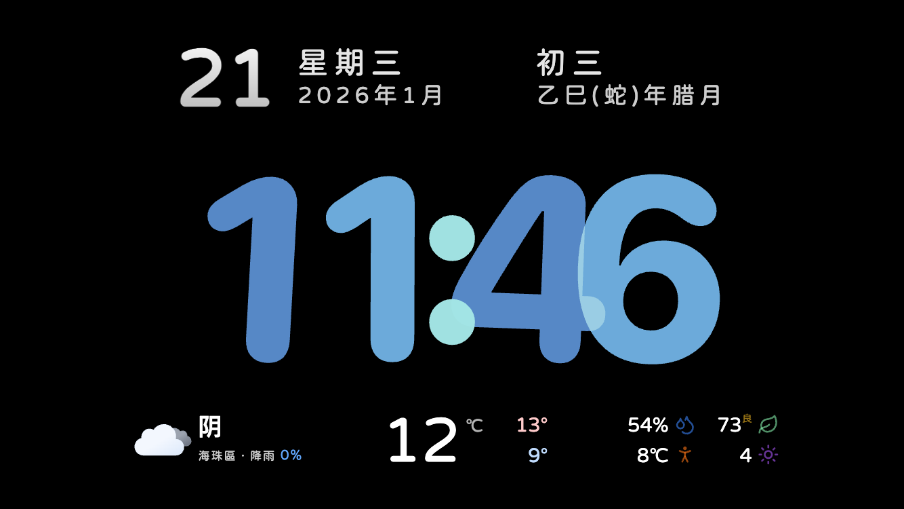
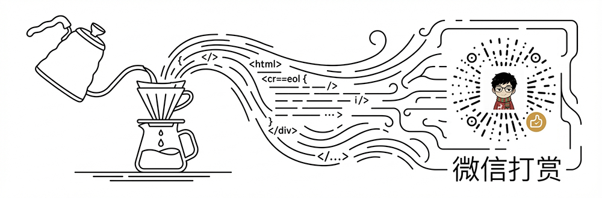

# Clock Dashboard Vue 2 | 天气时钟看板 Vue 2.7 版本

此项目为[Clock Dashboard](https://github.com/teojs/clock-dashboard)的 Vue 2.7 版本，目的是为了兼容低端系统，比如： iOS 9.3.6 的 iPad mini 1，由于系统性能问题，目前仅支持天气时钟，不支持HA、全屏日历等。后续只修复已知问题，不添加新功能。详细说明请看[Clock Dashboard](https://github.com/teojs/clock-dashboard)。

**🌐 在线地址：** [http://clock-legacy.teojs.cn/](http://clock-legacy.teojs.cn/)

---

## 📸 预览

---

## 📄 开源协议

本项目采用 [CC BY-NC-SA 4.0 (署名-非商业性使用-相同方式共享)](LICENSE) 协议。

**简而言之：**
您可以免费使用和修改本项目，但请务必保留原作者署名，且严禁将本项目的任何部分（包括修改后的版本）用于商业盈利目的。

---

## ☕️ 请我喝杯咖啡

